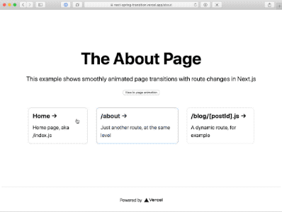

# Next.js + react-spring

This is a minimal demo Next.js app of using `react-spring`, [an animation library](https://www.react-spring.io/), for page transitions.



👉 See the demo: [next-spring-transition.vercel.app](https://next-spring-transition.vercel.app/)

## Animations
Two types of page transition animations are coded in.
1. **Scale effect, global** – This effect scales everything from 1.1x -> 1.0x, effectively looking like it's moving down in the z-axis. It is a global effect that happens at the start of every new page load, and is coded in `pages/_app.js`. I've seen other repos tackle this problem, but many were made before hooks were popularized. This method is a low-touch way to add animations to route changes without having to add code to each page.
2. **Intro and outro**  – The main problem this repo aims to show is how to choreograph intro and outro animations. For simplicity, the outro animations are simply the intro animations but in reverse (and it looks fine). You can look at `index.js`, `about.js` or `blog/[postId].js` as examples. (They are all nearly identical, to keep the example simple.)

## The key trick (for #2)
The key trick to initiating an outro animation is a combination of 
* Using `react-spring`'s `useChain` hook to easily sequence animations with timing.
* Within in each animation (e.g. `useSpring`, `useTrail`), using the `reverse` param to essentially run the animation backwards.
* Delaying the route change by toggling a state var and when the last animation finishes, then using `router.push()` to the new location. This is made possible by attaching a handler on the `onRest` param of `react-spring` animations. Unfortunately, this also requies bypassing the Next-provided `<Link>` and setting a couple of states, but this can easily be abstracted into a `<CustomLink>` of sorts.

## Run it locally
First, to run it. Download this repo, navigate to the repo.

```bash
yarn
# or `npm install`

yarn dev
# or `npm run dev`
```

Open [http://localhost:3000](http://localhost:3000) with your browser to see the result.